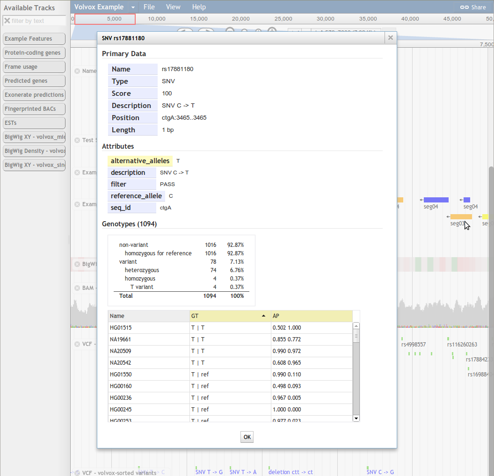

# Variant Tracks (VCF)

Beginning in JBrowse 1.9.0, JBrowse can display feature data directly from VCF files, and has an `HTMLVariants` track type that is optimized for displaying the potentially large amounts of detailed data that go with each variant.



VCF files used with the `VCFTabix` must be compressed with `bgzip` and indexed with `tabix`, both of which are part of the [samtools](http://samtools.sourceforge.net/) package. This is usually done with commands like:
```
   bgzip my.vcf
   tabix -p vcf my.vcf.gz
```

## Example VCF-based Variant Track Configuration

Here is an example track configuration stanza for a variant track displaying data directly from a [VCF file](http://www.1000genomes.org/wiki/Analysis/Variant%20Call%20Format/vcf-variant-call-format-version-41). Note that the URL in `urlTemplate` is relative to the directory where the configuration file is located. Note that `tbiUrlTemplate` can also be used if your tbi file is named anything other than the urlTemplate with .tbi added to the end.

~~~~ {.javascript}
      {
         "label"         : "mysnps",
         "key"           : "SNPs from VCF",
         "storeClass"    : "JBrowse/Store/SeqFeature/VCFTabix",
         "urlTemplate"   : "mydata.vcf.gz",
         "type"          : "JBrowse/View/Track/HTMLVariants"
      }
~~~~

Alternatively, if you are using the tracks.conf format, then a similar example would look like the following

    [ tracks.myvcf ]
    storeClass     = JBrowse/Store/SeqFeature/VCFTabix
    urlTemplate    = mydata.vcf.gz
    category = VCF
    type = JBrowse/View/Track/CanvasVariants
    key  = SNPs from VCF

Note that the file mydata.vcf.gz is resolved relative to the "data directory" being used, so just put the file inside the same directory as the trackList.json or tracks.conf. You can also use relative URL or fully qualified HTTP(s) urls in the urlTemplate parameter too

Also note: the tabix index (".tbi"), CSI index (".csi"), or tribble index (".idx") must be available as well. The tabix index is the default and it will simply look for the urlTemplate parameter with ".tbi" added on the end if nothing else is specified. If you are using CSI index, then manually specify the csiUrlTemplate parameter.

### VCF-Tribble

JBrowse 1.14 added support for VCF tribble indexes from htsjdk. Users can open tracks that use VCF tribble using the "Track"->"Open track" option or specify it in their config manually using the storeClass `JBrowse/Store/SeqFeature/VCFTribble`


### Using VCF Filters in configuration

The two variables hideNotFilterPass or hideFilterPass can be used to define whether to filter some variants by default. For example adding hideNotFilterPass: 1 will show the variants that passed all filters by default (i.e. it hides all the features that didn't pass all the filters)

`"hideNotFilterPass": 1`


